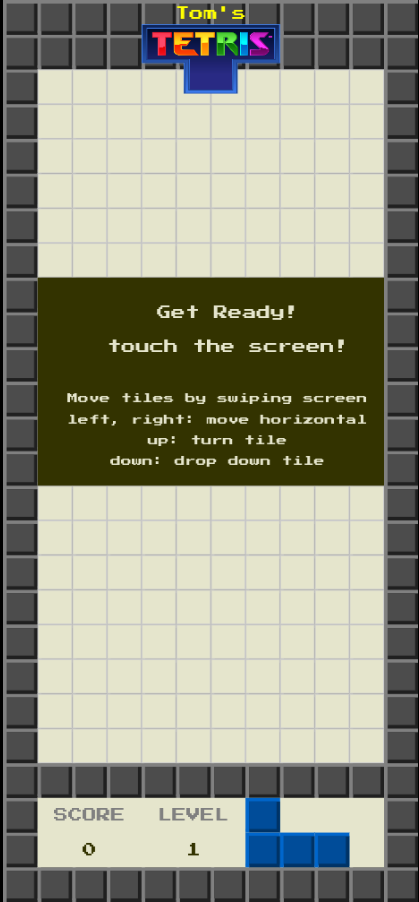
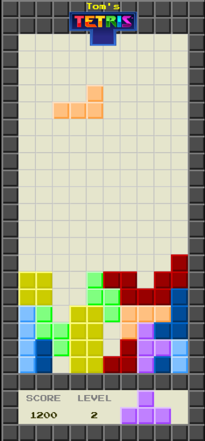

# My implementation of Tetris as browser game

## Usage
Run the game: clone the repository and load the file 'index.html' into the browser.

## Screenshots
Here you can see some screenshots of my Tetris version.

*Tetris is ready*

*Tetris is running*
